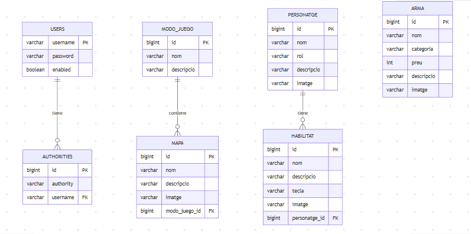
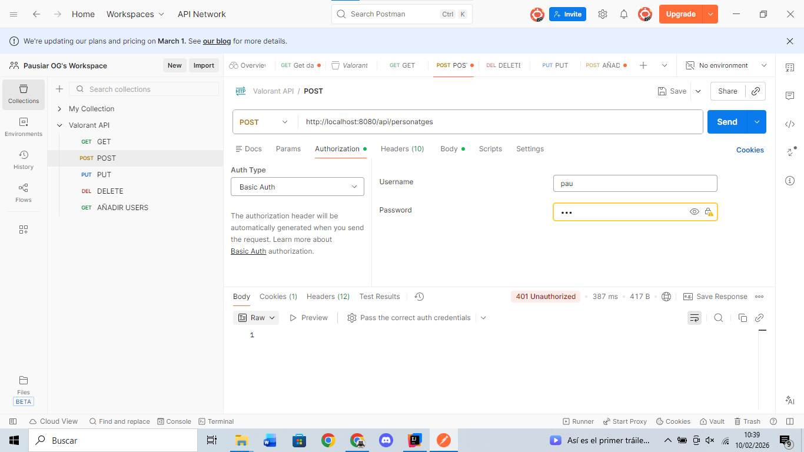
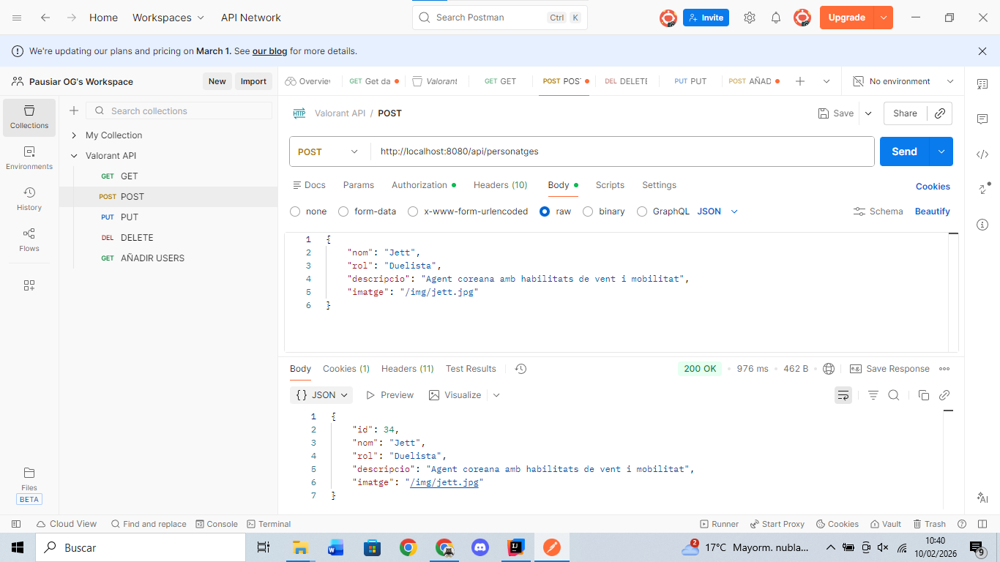
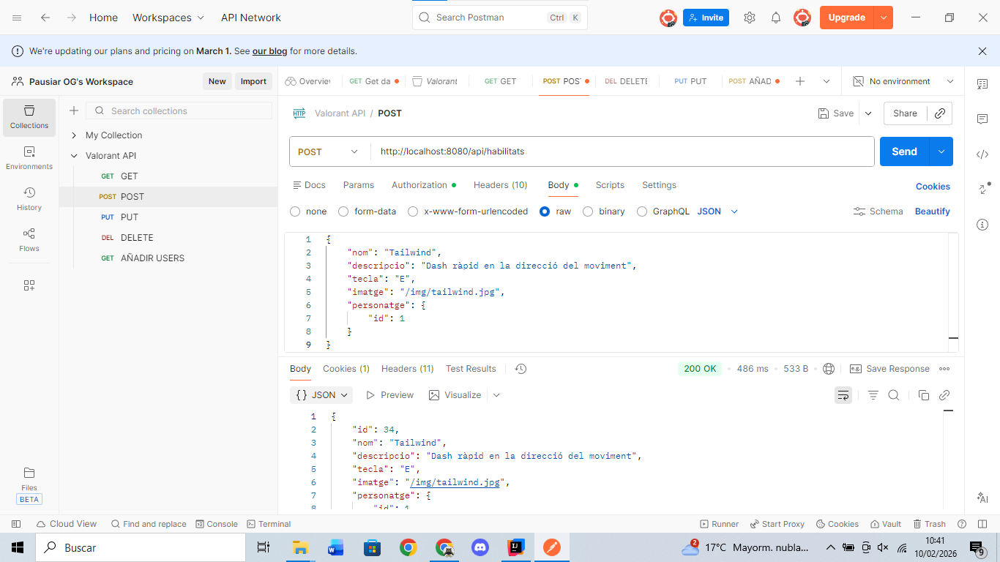
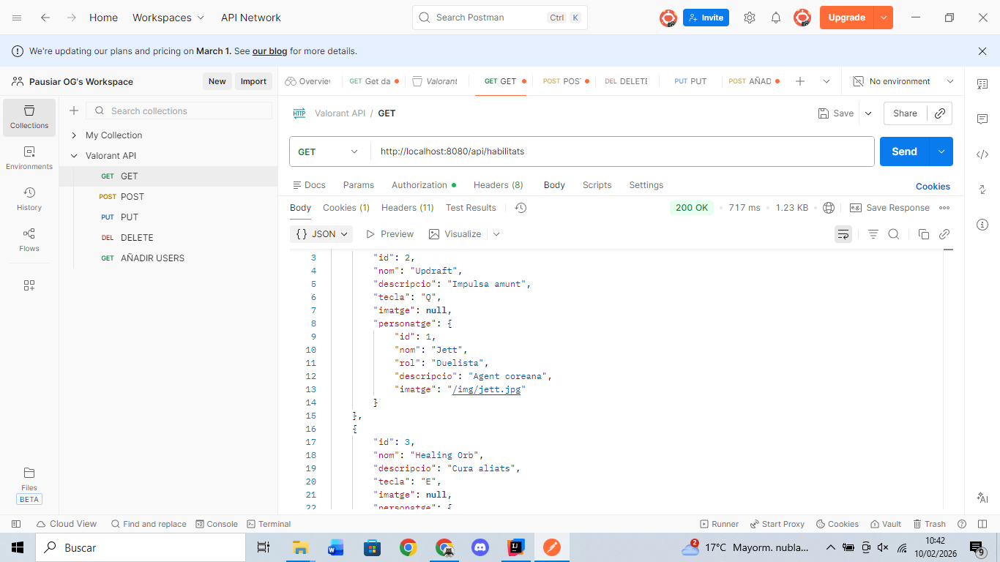
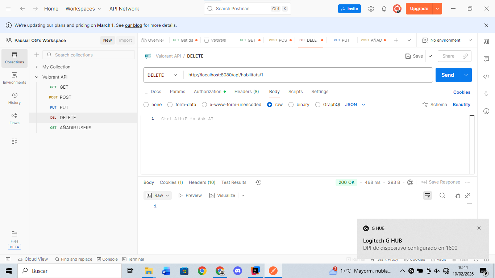
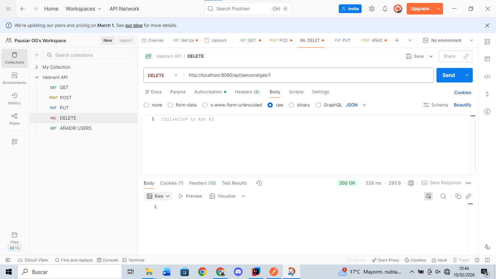

# Memòria API REST Valorant

## 1) Què fa l'API

Aquesta aplicació gestiona informació relacionada amb el videojoc **Valorant**, incloent els seus personatges (agents), habilitats, armes, mapes i modes de joc. 

Es tracta d'una **API REST**, un tipus d'arquitectura que permet la comunicació entre client i servidor mitjançant el protocol HTTP. Les dades s'intercanvien en format **JSON**.

L'accés a les dades es realitza mitjançant **endpoints HTTP**, que són URLs específiques que permeten realitzar operacions CRUD (Create, Read, Update, Delete) sobre les diferents entitats del sistema.

---

## 2) Model de dades

Descripció de cada entitat del sistema:

* **ModoJuego**: guarda els diferents modes de joc disponibles a Valorant (Competitiu, Deathmatch, etc.).
* **Mapa**: guarda els mapes del joc i indica a quin mode de joc pertanyen.
* **Personatge**: guarda els agents jugables amb el seu rol (Duelista, Sentinella, etc.).
* **Habilitat**: guarda les habilitats de cada agent i indica a quin personatge pertanyen.
* **Arma**: guarda les armes disponibles al joc amb la seva categoria i preu.
* **User**: guarda els usuaris registrats al sistema per a l'autenticació.
* **Authority**: guarda els rols/permisos dels usuaris.

---

## 3) Diagrama E/R de la base de dades



### Relacions entre entitats:

* Un **mode de joc** pot tindre **molts mapes**.
* Un **mapa** pertany a **un mode de joc**.
* Un **personatge** pot tindre **moltes habilitats**.
* Una **habilitat** pertany a **un o varios personatge** (hi ha habilitats que tenen varios personatges y altres que nomes la te uno).
* Una **arma** és una entitat independent sense relacions.
* Un **usuari** pot tindre **molts rols/authorities**.

---

## 4) Endpoints de l'API

### ARMES

#### GET /api/armes (llistar totes)
```java
@GetMapping("/armes")
public List<Arma> obtindreArmes() {
    return (List<Arma>) armaRepository.findAll();
}
```

#### GET /api/armes/{id} (obtindre una per id)
```java
@GetMapping("/armes/{id}")
public Arma obtindreArmaPerId(@PathVariable Long id) {
    return armaRepository.findById(id).orElse(null);
}
```

#### POST /api/armes (crear)
```java
@PostMapping("/armes")
public Arma afegirArma(@RequestBody Arma arma) {
    return armaRepository.save(arma);
}
```

#### PUT /api/armes/{id} (actualitzar)
```java
@PutMapping("/armes/{id}")
public Arma actualitzarArma(@PathVariable Long id, @RequestBody Arma arma) {
    if (!armaRepository.existsById(id)) {
        return null;
    }
    arma.setId(id);
    return armaRepository.save(arma);
}
```

#### DELETE /api/armes/{id} (eliminar)
```java
@DeleteMapping("/armes/{id}")
public void eliminarArma(@PathVariable Long id) {
    armaRepository.deleteById(id);
}
```

---

### HABILITATS

#### GET /api/habilitats (llistar totes)
```java
@GetMapping("/habilitats")
public List<Habilitat> obtindreHabilitats() {
    return (List<Habilitat>) habilitatRepository.findAll();
}
```

#### GET /api/habilitats/{id} (obtindre una per id)
```java
@GetMapping("/habilitats/{id}")
public Habilitat obtindreHabilitatPerId(@PathVariable Long id) {
    return habilitatRepository.findById(id).orElse(null);
}
```

#### POST /api/habilitats (crear)
```java
@PostMapping("/habilitats")
public Habilitat afegirHabilitat(@RequestBody Habilitat habilitat) {
    return habilitatRepository.save(habilitat);
}
```

#### PUT /api/habilitats/{id} (actualitzar)
```java
@PutMapping("/habilitats/{id}")
public Habilitat actualitzarHabilitat(@PathVariable Long id, @RequestBody Habilitat habilitat) {
    if (!habilitatRepository.existsById(id)) {
        return null;
    }
    habilitat.setId(id);
    return habilitatRepository.save(habilitat);
}
```

#### DELETE /api/habilitats/{id} (eliminar)
```java
@DeleteMapping("/habilitats/{id}")
public void eliminarHabilitat(@PathVariable Long id) {
    habilitatRepository.deleteById(id);
}
```

---

### MAPES

#### GET /api/mapes (llistar tots)
```java
@GetMapping("/mapes")
public List<Mapa> obtindreMapes() {
    return (List<Mapa>) mapaRepository.findAll();
}
```

#### GET /api/mapes/{id} (obtindre un per id)
```java
@GetMapping("/mapes/{id}")
public Mapa obtindreMapaPerId(@PathVariable Long id) {
    return mapaRepository.findById(id).orElse(null);
}
```

#### POST /api/mapes (crear)
```java
@PostMapping("/mapes")
public Mapa afegirMapa(@RequestBody Mapa mapa) {
    return mapaRepository.save(mapa);
}
```

#### PUT /api/mapes/{id} (actualitzar)
```java
@PutMapping("/mapes/{id}")
public Mapa actualitzarMapa(@PathVariable Long id, @RequestBody Mapa mapa) {
    if (!mapaRepository.existsById(id)) {
        return null;
    }
    mapa.setId(id);
    return mapaRepository.save(mapa);
}
```

#### DELETE /api/mapes/{id} (eliminar)
```java
@DeleteMapping("/mapes/{id}")
public void eliminarMapa(@PathVariable Long id) {
    mapaRepository.deleteById(id);
}
```

---

### MODOS DE JUEGO

#### GET /api/modosjuego (llistar tots)
```java
@GetMapping("/modosjuego")
public List<ModoJuego> obtindreModos() {
    return (List<ModoJuego>) modoJuegoRepository.findAll();
}
```

#### GET /api/modosjuego/{id} (obtindre un per id)
```java
@GetMapping("/modosjuego/{id}")
public ModoJuego obtindreModoPerId(@PathVariable Long id) {
    return modoJuegoRepository.findById(id).orElse(null);
}
```

#### POST /api/modosjuego (crear)
```java
@PostMapping("/modosjuego")
public ModoJuego afegirModo(@RequestBody ModoJuego modoJuego) {
    return modoJuegoRepository.save(modoJuego);
}
```

#### PUT /api/modosjuego/{id} (actualitzar)
```java
@PutMapping("/modosjuego/{id}")
public ModoJuego actualitzarModo(@PathVariable Long id, @RequestBody ModoJuego modoJuego) {
    if (!modoJuegoRepository.existsById(id)) {
        return null;
    }
    modoJuego.setId(id);
    return modoJuegoRepository.save(modoJuego);
}
```

#### DELETE /api/modosjuego/{id} (eliminar)
```java
@DeleteMapping("/modosjuego/{id}")
public void eliminarModo(@PathVariable Long id) {
    modoJuegoRepository.deleteById(id);
}
```

---

### PERSONATGES

#### GET /api/personatges (llistar tots)
```java
@GetMapping("/personatges")
public List<Personatge> obtindrePersonatges() {
    return (List<Personatge>) personatgeRepository.findAll();
}
```

#### GET /api/personatges/{id} (obtindre un per id)
```java
@GetMapping("/personatges/{id}")
public Personatge obtindrePersonatgePerId(@PathVariable Long id) {
    return personatgeRepository.findById(id).orElse(null);
}
```

#### POST /api/personatges (crear)
```java
@PostMapping("/personatges")
public Personatge afegirPersonatge(@RequestBody Personatge personatge) {
    return personatgeRepository.save(personatge);
}
```

#### PUT /api/personatges/{id} (actualitzar)
```java
@PutMapping("/personatges/{id}")
public Personatge actualitzarPersonatge(@PathVariable Long id, @RequestBody Personatge personatge) {
    if (!personatgeRepository.existsById(id)) {
        return null;
    }
    personatge.setId(id);
    return personatgeRepository.save(personatge);
}
```

#### DELETE /api/personatges/{id} (eliminar)
```java
@DeleteMapping("/personatges/{id}")
public void eliminarPersonatge(@PathVariable Long id) {
    personatgeRepository.deleteById(id);
}
```

---

## 5) Ordre correcte de treball

Per provar l'API amb Postman, he seguit aquest ordre:

1. **Primer**: Crear els **Modes de Joc** (Competitiu, Deathmatch, etc.)
2. **Segon**: Crear els **Mapes** assignant-los a un mode de joc existent
3. **Tercer**: Crear els **Personatges** (agents)
4. **Quart**: Crear les **Habilitats** assignant-les a un personatge existent
5. **Cinquè**: Crear les **Armes** (es poden crear en qualsevol moment perquè no tenen dependències)

He seguit aquest ordre perquè és necessari respectar les **claus foranes**. Per exemple, no puc crear un mapa sense abans haver creat el mode de joc al qual pertany, ja que el mapa necessita referenciar un `modo_juego_id` vàlid. El mateix passa amb les habilitats, que necessiten un `personatge_id` existent.

---

## 6) Proves amb Postman

### 6.1) GET - Llistar tots els personatges


---

### 6.2) POST - Crear un nou element


---

### 6.3) GET - Verificar creació


---

### 6.4) PUT - Actualitzar un element


---

### 6.5) DELETE - Eliminar un element


---

### 6.6) GET - Verificar eliminació


---

## 7) Conclusions del projecte

Durant el desenvolupament d'aquest projecte he après com funciona una API REST i com s'utilitzen els endpoints per treballar amb les dades. Cada endpoint correspon a una operació específica: GET per consultar, POST per crear, PUT per actualitzar i DELETE per eliminar.

Una de les coses més importants que he descobert és què passa quan s'intenta crear o eliminar dades que estan relacionades amb altres taules. Per exemple, si volia crear una habilitat, primer havia de tindre un personatge creat perquè l'habilitat necessita referenciar-lo. De la mateixa manera, quan intentava eliminar un personatge que tenia habilitats associades, el sistema em donava un error d'integritat referencial fins que vaig implementar l'eliminació en cascada.

Per provar la relació entre personatges i habilitats, vaig haver de seguir un ordre específic: primer crear el personatge, després crear les habilitats amb la referència al personatge, i finalment comprovar amb GET que la relació s'havia establert correctament.

La part del procés que m'ha obligat a entendre millor l'estructura de la base de dades ha sigut precisament la gestió de les relacions entre taules. Vaig haver d'entendre com funcionen les claus foranes i per què és important l'ordre en què es creen i s'eliminen les dades. També vaig aprendre a utilitzar les anotacions de JPA com `@ManyToOne` i `@OneToMany` per definir les relacions entre entitats, i com configurar el `cascade` per gestionar les eliminacions automàtiques.
